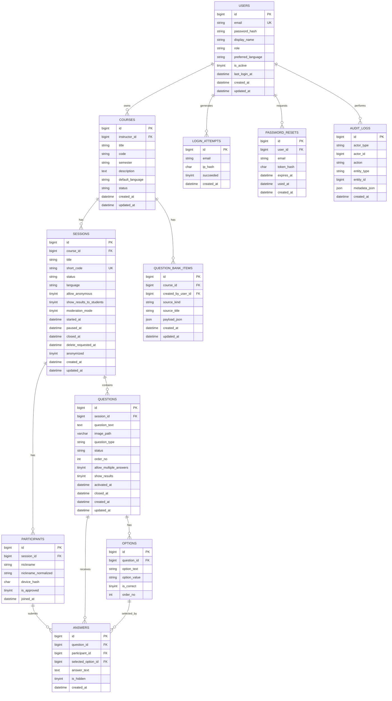

# Data Model — eduQR

This document defines every table eduQR uses, its columns, constraints, indexes, and relationships. It is the source of truth for the schema. The canonical SQL lives in `database/schema.sql`; this document explains *why* each column exists and what rules apply.

**Locked decisions (do not deviate):**

- Auth table is **`users`** with `role ENUM('admin','instructor')`. There is **no** separate `instructors` table.
- All identifiers are `snake_case`.
- Primary keys are `id BIGINT UNSIGNED AUTO_INCREMENT`.
- Timestamps are `DATETIME`, stored in **UTC**.
- Charset is `utf8mb4`, collation `utf8mb4_unicode_ci`.
- Engine is `InnoDB`.
- Foreign keys are explicitly named `fk_<table>_<column>`.

---

## 1. Entity-Relationship Overview



---

## 2. Table Definitions

### 2.1 `users`

Holds instructor and admin accounts. **Students do not appear here.**

```sql
CREATE TABLE users (
    id                  BIGINT UNSIGNED AUTO_INCREMENT PRIMARY KEY,
    email               VARCHAR(190) NOT NULL UNIQUE,
    password_hash       VARCHAR(255) NOT NULL,
    display_name        VARCHAR(150) NOT NULL,
    role                ENUM('admin','instructor') NOT NULL DEFAULT 'instructor',
    preferred_language  VARCHAR(8)   NOT NULL DEFAULT 'en',
    is_active           TINYINT(1)   NOT NULL DEFAULT 1,
    last_login_at       DATETIME     NULL,
    created_at          DATETIME     NOT NULL DEFAULT CURRENT_TIMESTAMP,
    updated_at          DATETIME     NOT NULL DEFAULT CURRENT_TIMESTAMP
                                              ON UPDATE CURRENT_TIMESTAMP
) ENGINE=InnoDB DEFAULT CHARSET=utf8mb4 COLLATE=utf8mb4_unicode_ci;
```

Rules:

- `email` is unique and used for login.
- `password_hash` never stores plain text. Always `password_hash($pw, PASSWORD_BCRYPT, ['cost' => 12])`.
- `preferred_language` must be one of the active locales; defaults to `en`.
- `is_active = 0` disables login without deleting the row.

### 2.2 `courses`

A course taught by one instructor.

```sql
CREATE TABLE courses (
    id                BIGINT UNSIGNED AUTO_INCREMENT PRIMARY KEY,
    instructor_id     BIGINT UNSIGNED NOT NULL,
    title             VARCHAR(200) NOT NULL,
    code              VARCHAR(40)  NULL,
    semester          VARCHAR(40)  NULL,
    description       TEXT         NULL,
    default_language  VARCHAR(8)   NOT NULL DEFAULT 'en',
    status            ENUM('active','archived') NOT NULL DEFAULT 'active',
    created_at        DATETIME     NOT NULL DEFAULT CURRENT_TIMESTAMP,
    updated_at        DATETIME     NOT NULL DEFAULT CURRENT_TIMESTAMP
                                            ON UPDATE CURRENT_TIMESTAMP,
    INDEX idx_courses_instructor (instructor_id),
    INDEX idx_courses_status (status),
    CONSTRAINT fk_courses_instructor
        FOREIGN KEY (instructor_id) REFERENCES users(id) ON DELETE CASCADE
) ENGINE=InnoDB DEFAULT CHARSET=utf8mb4 COLLATE=utf8mb4_unicode_ci;
```

Rules:

- `instructor_id` must reference a `users` row whose `role = 'instructor'` (enforced at the service layer; the FK only guarantees a valid `users` row exists).
- Archiving sets `status = 'archived'`; sessions are preserved.
- Course ownership is enforced in `CourseService` — an instructor can only read/modify their own courses (`FR-14`).

### 2.3 `sessions`

A single in-class live session. `short_code` is what the QR encodes.

> **Naming caution:** this `sessions` table is the eduQR domain object. It is **not** the PHP HTTP session used for instructor login. See `GLOSSARY.md`.

```sql
CREATE TABLE sessions (
    id                        BIGINT UNSIGNED AUTO_INCREMENT PRIMARY KEY,
    course_id                 BIGINT UNSIGNED NOT NULL,
    title                     VARCHAR(200) NOT NULL,
    topic_name                VARCHAR(200) NULL,
    short_code                VARCHAR(8)   NOT NULL UNIQUE,
    status                    ENUM('draft','active','paused','closed') NOT NULL DEFAULT 'active',
    language                  VARCHAR(8)   NOT NULL DEFAULT 'en',
    allow_anonymous           TINYINT(1)   NOT NULL DEFAULT 1,
    show_results_to_students  TINYINT(1)   NOT NULL DEFAULT 0,
    moderation_mode           TINYINT(1)   NOT NULL DEFAULT 0,
    started_at                DATETIME     NULL,
    paused_at                 DATETIME     NULL,
    closed_at                 DATETIME     NULL,
    delete_requested_at       DATETIME     NULL,
    anonymized                TINYINT(1)   NOT NULL DEFAULT 0,
    created_at                DATETIME     NOT NULL DEFAULT CURRENT_TIMESTAMP,
    updated_at                DATETIME     NOT NULL DEFAULT CURRENT_TIMESTAMP
                                                    ON UPDATE CURRENT_TIMESTAMP,
    INDEX idx_sessions_course (course_id),
    INDEX idx_sessions_status (status),
    INDEX idx_sessions_delete_requested (delete_requested_at),
    CONSTRAINT fk_sessions_course
        FOREIGN KEY (course_id) REFERENCES courses(id) ON DELETE CASCADE
) ENGINE=InnoDB DEFAULT CHARSET=utf8mb4 COLLATE=utf8mb4_unicode_ci;
```

Rules:

- `short_code` is unique, 6 characters, charset `A-H J-N P-Z 2-9`. Generated server-side with collision retry.
- `topic_name` stores the instructor-selected lecture topic for this session (optional, max 200).
- Status lifecycle: `draft → active → paused ⇄ active → closed`. Once `closed`, no transitions back.
- `closed` sessions reject new participants and new answers (`FR-24`).
- `paused` sessions reject new answers (`FR-25`).
- `moderation_mode = 1` requires open-text answers to be approved before public display (`FR-55`).
- `delete_requested_at` set means a soft delete is pending; hard delete after 7 days (`FR-71`).
- `anonymized = 1` means participant nicknames/hashes have been stripped (`FR-70`).

### 2.4 `questions`

Each question belongs to one session.

```sql
CREATE TABLE questions (
    id                      BIGINT UNSIGNED AUTO_INCREMENT PRIMARY KEY,
    session_id              BIGINT UNSIGNED NOT NULL,
    question_text           TEXT         NOT NULL,
    image_path              VARCHAR(500) NULL DEFAULT NULL,
    question_type           ENUM('multiple_choice','open_text','yes_no','likert_5') NOT NULL,
    stage                   ENUM('opening','middle','closing') NOT NULL DEFAULT 'middle',
    status                  ENUM('draft','active','closed') NOT NULL DEFAULT 'draft',
    order_no                INT          NOT NULL DEFAULT 0,
    allow_multiple_answers  TINYINT(1)   NOT NULL DEFAULT 0,
    show_results            TINYINT(1)   NOT NULL DEFAULT 0,
    activated_at            DATETIME     NULL,
    closed_at               DATETIME     NULL,
    created_at              DATETIME     NOT NULL DEFAULT CURRENT_TIMESTAMP,
    updated_at              DATETIME     NOT NULL DEFAULT CURRENT_TIMESTAMP
                                                  ON UPDATE CURRENT_TIMESTAMP,
    INDEX idx_questions_session (session_id),
    INDEX idx_questions_session_status (session_id, status),
    INDEX idx_questions_session_stage_order (session_id, stage, order_no),
    CONSTRAINT fk_questions_session
        FOREIGN KEY (session_id) REFERENCES sessions(id) ON DELETE CASCADE
) ENGINE=InnoDB DEFAULT CHARSET=utf8mb4 COLLATE=utf8mb4_unicode_ci;
```

Rules:

- **One-active-question rule (`FR-33`):** at most one row per `session_id` may have `status = 'active'`. MySQL InnoDB has no partial unique index, so this is enforced in `QuestionService::activate()` inside a transaction that closes any other active question first.
- `stage` marks instructional phase: `opening`, `middle`, `closing`; import and UI should schedule in this order.
- Closed questions reject new answers (`FR-44`).
- Draft questions are never visible to students.
- `question_text` 1–500 chars (`FR-36`). Sanitized before display.
- `image_path` optional, relative path under `public/uploads/questions/` (`FR-39`). NULL when no image. Deleted on question delete (CASCADE) or when replaced via the image endpoint.
- `allow_multiple_answers` default `false`; controls the `answers` uniqueness rule.

### 2.5 `question_bank_items`

Reusable course-scoped question templates. Each row stores a normalized question payload in `payload_json` so it can be copied into any future session for the same course.

```sql
CREATE TABLE question_bank_items (
    id                 BIGINT UNSIGNED AUTO_INCREMENT PRIMARY KEY,
    course_id          BIGINT UNSIGNED NOT NULL,
    created_by_user_id BIGINT UNSIGNED NOT NULL,
    source_kind        ENUM('session_question','lecture_notes') NOT NULL DEFAULT 'session_question',
    source_title       VARCHAR(200) NULL,
    payload_json       JSON NOT NULL,
    created_at         DATETIME NOT NULL DEFAULT CURRENT_TIMESTAMP,
    updated_at         DATETIME NOT NULL DEFAULT CURRENT_TIMESTAMP
                                          ON UPDATE CURRENT_TIMESTAMP,
    INDEX idx_question_bank_course (course_id),
    INDEX idx_question_bank_creator (created_by_user_id),
    INDEX idx_question_bank_course_source (course_id, source_kind),
    CONSTRAINT fk_question_bank_course
        FOREIGN KEY (course_id) REFERENCES courses(id) ON DELETE CASCADE,
    CONSTRAINT fk_question_bank_creator
        FOREIGN KEY (created_by_user_id) REFERENCES users(id) ON DELETE CASCADE
) ENGINE=InnoDB DEFAULT CHARSET=utf8mb4 COLLATE=utf8mb4_unicode_ci;
```

Rules:

- `course_id` scopes reuse to later sessions in the same course.
- `created_by_user_id` records which instructor saved or generated the bank item.
- `source_kind` describes whether the item came from an existing session question or lecture-note generation.
- `payload_json` stores the question body shape used by `QuestionService::create()` so the item can be cloned into a session without loss of structure.

### 2.6 `options`

Choices for `multiple_choice`, `yes_no`, and `likert_5` questions. For `open_text`, this table has zero rows for that question.

```sql
CREATE TABLE options (
    id            BIGINT UNSIGNED AUTO_INCREMENT PRIMARY KEY,
    question_id   BIGINT UNSIGNED NOT NULL,
    option_text   VARCHAR(200) NOT NULL,
    option_value  VARCHAR(100) NULL,
    is_correct    TINYINT(1)   NOT NULL DEFAULT 0,
    order_no      INT          NOT NULL DEFAULT 0,
    INDEX idx_options_question (question_id),
    CONSTRAINT fk_options_question
        FOREIGN KEY (question_id) REFERENCES questions(id) ON DELETE CASCADE
) ENGINE=InnoDB DEFAULT CHARSET=utf8mb4 COLLATE=utf8mb4_unicode_ci;
```

Rules:

- `option_text` 1–200 chars (`FR-36`). Sanitized before display.
- `is_correct` is optional, used only if quiz mode arrives later. Not required for polling.
- `multiple_choice` has 2–8 options (`FR-32`).
- `yes_no` has exactly 2 options, generated automatically with `option_value` `yes` / `no`.
- `likert_5` has exactly 5 options, `option_value` `1`–`5`.

### 2.7 `participants`

Anonymous-ish students who joined a session.

```sql
CREATE TABLE participants (
    id                    BIGINT UNSIGNED AUTO_INCREMENT PRIMARY KEY,
    session_id            BIGINT UNSIGNED NOT NULL,
    nickname              VARCHAR(48)  NOT NULL,
    nickname_normalized   VARCHAR(48)  NOT NULL,
    device_hash           CHAR(64)     NULL,
    is_approved           TINYINT(1)   NOT NULL DEFAULT 1,
    joined_at             DATETIME     NOT NULL DEFAULT CURRENT_TIMESTAMP,
    INDEX idx_participants_session (session_id),
    UNIQUE KEY uk_participants_nickname (session_id, nickname_normalized),
    CONSTRAINT fk_participants_session
        FOREIGN KEY (session_id) REFERENCES sessions(id) ON DELETE CASCADE
) ENGINE=InnoDB DEFAULT CHARSET=utf8mb4 COLLATE=utf8mb4_unicode_ci;
```

Rules:

- `nickname` 1–24 chars, charset `^[\p{L}\p{N}_\- ]+$`, trimmed, sanitized, profanity-filtered.
- `nickname_normalized` is `LOWER(TRIM(nickname))` — enforces case-insensitive uniqueness within a session (`FR-42`).
- `device_hash` is `SHA-256(server_secret || persistent_cookie_id || user_agent)`. **Never displayed, never exported** (`FR-73`).
- `is_approved` reserved for future moderated-join flows; defaults to `1`.
- Anonymization (`FR-70`) sets `nickname` and `nickname_normalized` to a placeholder like `anon_<id>` and `device_hash` to `NULL`.

### 2.8 `answers`

A submitted answer. Exactly one of `selected_option_id` / `answer_text` is populated.

```sql
CREATE TABLE answers (
    id                  BIGINT UNSIGNED AUTO_INCREMENT PRIMARY KEY,
    question_id         BIGINT UNSIGNED NOT NULL,
    participant_id      BIGINT UNSIGNED NOT NULL,
    selected_option_id  BIGINT UNSIGNED NULL,
    answer_text         TEXT         NULL,
    is_hidden           TINYINT(1)   NOT NULL DEFAULT 0,
    created_at          DATETIME     NOT NULL DEFAULT CURRENT_TIMESTAMP,
    UNIQUE KEY uk_answers_question_participant (question_id, participant_id),
    INDEX idx_answers_question (question_id),
    INDEX idx_answers_participant (participant_id),
    CONSTRAINT fk_answers_question
        FOREIGN KEY (question_id) REFERENCES questions(id) ON DELETE CASCADE,
    CONSTRAINT fk_answers_participant
        FOREIGN KEY (participant_id) REFERENCES participants(id) ON DELETE CASCADE,
    CONSTRAINT fk_answers_option
        FOREIGN KEY (selected_option_id) REFERENCES options(id) ON DELETE SET NULL
) ENGINE=InnoDB DEFAULT CHARSET=utf8mb4 COLLATE=utf8mb4_unicode_ci;
```

Rules:

- `UNIQUE (question_id, participant_id)` enforces "one answer per participant per question" (`FR-44`). When `questions.allow_multiple_answers = true`, the service layer must use a different code path — see note below.
- For option-based question types, `selected_option_id` is required and `answer_text` is NULL.
- For `open_text`, `answer_text` is required (1–2000 chars, sanitized) and `selected_option_id` is NULL.
- Never both populated, never both NULL — enforced in `AnswerService::validateAnswerShape()`.
- `is_hidden = 1` lets an instructor exclude an inappropriate open-text answer from public display and reports (`FR-55`).

> **`allow_multiple_answers` and the unique index:** When a question allows multiple answers, the `UNIQUE (question_id, participant_id)` index would block the second insert. For MVP, `allow_multiple_answers` defaults to `false` and is not exposed in the question-creation UI; the column and flag exist so the schema is forward-compatible. If/when multiple answers are enabled, a migration must drop this unique index and the service layer becomes solely responsible for any per-question answer caps. Document that change in an ADR.

### 2.9 `audit_logs`

Records important system actions (`FR-90`).

```sql
CREATE TABLE audit_logs (
    id            BIGINT UNSIGNED AUTO_INCREMENT PRIMARY KEY,
    actor_type    ENUM('instructor','admin','system') NOT NULL,
    actor_id      BIGINT UNSIGNED NULL,
    action        VARCHAR(80)  NOT NULL,
    entity_type   VARCHAR(40)  NULL,
    entity_id     BIGINT UNSIGNED NULL,
    metadata_json JSON         NULL,
    created_at    DATETIME     NOT NULL DEFAULT CURRENT_TIMESTAMP,
    INDEX idx_audit_actor (actor_type, actor_id),
    INDEX idx_audit_action (action, created_at),
    INDEX idx_audit_entity (entity_type, entity_id)
) ENGINE=InnoDB DEFAULT CHARSET=utf8mb4 COLLATE=utf8mb4_unicode_ci;
```

Tracked actions: `session.created`, `session.closed`, `session.anonymized`, `session.deleted`, `question.activated`, `question.closed`, `report.exported`, `user.created`.

Retention: 365 days.

### 2.10 `login_attempts`

For rate-limiting failed logins (`FR-05`).

```sql
CREATE TABLE login_attempts (
    id          BIGINT UNSIGNED AUTO_INCREMENT PRIMARY KEY,
    email       VARCHAR(190) NOT NULL,
    ip_hash     CHAR(64)     NULL,
    succeeded   TINYINT(1)   NOT NULL DEFAULT 0,
    created_at  DATETIME     NOT NULL DEFAULT CURRENT_TIMESTAMP,
    INDEX idx_attempts_email_time (email, created_at)
) ENGINE=InnoDB DEFAULT CHARSET=utf8mb4 COLLATE=utf8mb4_unicode_ci;
```

Rate-limit rule: ≥ 5 rows with `succeeded = 0` for the same `email` within 10 minutes → 15-minute lockout. `ip_hash` is a salted hash; raw IP is never stored.

Retention: 90 days.

### 2.11 `password_resets`

Email-based password reset tokens for instructors (`FR-06`).

```sql
CREATE TABLE password_resets (
    id          BIGINT UNSIGNED AUTO_INCREMENT PRIMARY KEY,
    user_id     BIGINT UNSIGNED NOT NULL,
    email       VARCHAR(190) NOT NULL,
    token_hash  CHAR(64) NOT NULL UNIQUE,
    expires_at  DATETIME NOT NULL,
    used_at     DATETIME NULL,
    created_at  DATETIME NOT NULL DEFAULT CURRENT_TIMESTAMP,
    INDEX idx_password_resets_user (user_id),
    INDEX idx_password_resets_email (email),
    INDEX idx_password_resets_expires_at (expires_at),
    CONSTRAINT fk_password_resets_user
        FOREIGN KEY (user_id) REFERENCES users(id) ON DELETE CASCADE
) ENGINE=InnoDB DEFAULT CHARSET=utf8mb4 COLLATE=utf8mb4_unicode_ci;
```

Rules:

- Tokens are stored only as SHA-256 hashes.
- Reset links expire after 60 minutes.
- A used token cannot be reused.
- Creating a new reset request clears prior requests for the same user.

Retention: 30 days.

### 2.12 `schema_migrations`

Tracks applied migrations. Created by `bin/migrate.php`.

```sql
CREATE TABLE schema_migrations (
    filename    VARCHAR(120) PRIMARY KEY,
    applied_at  DATETIME NOT NULL DEFAULT CURRENT_TIMESTAMP
) ENGINE=InnoDB DEFAULT CHARSET=utf8mb4 COLLATE=utf8mb4_unicode_ci;
```

### 2.13 `locales` (metadata)

Lists supported locales for the language switcher. Translation strings themselves live in JSON files, **not** the database.

```sql
CREATE TABLE locales (
    code           VARCHAR(8)  PRIMARY KEY,
    label_native   VARCHAR(40) NOT NULL,
    label_english  VARCHAR(40) NOT NULL,
    is_rtl         TINYINT(1)  NOT NULL DEFAULT 0,
    is_active      TINYINT(1)  NOT NULL DEFAULT 1,
    sort_order     INT         NOT NULL DEFAULT 0
) ENGINE=InnoDB DEFAULT CHARSET=utf8mb4 COLLATE=utf8mb4_unicode_ci;
```

---

## 3. Relationships Summary

```text
users         1 ─── *  courses          (instructor_id)
courses       1 ─── *  sessions         (course_id)
sessions      1 ─── *  questions        (session_id)
sessions      1 ─── *  participants     (session_id)
questions     1 ─── *  options          (question_id)
questions     1 ─── *  answers          (question_id)
participants  1 ─── *  answers          (participant_id)
options       1 ─── *  answers          (selected_option_id, nullable)
```

All foreign keys use `ON DELETE CASCADE` except `answers.selected_option_id`, which uses `ON DELETE SET NULL` so that deleting an option does not destroy the answer record (the aggregate count is recoverable from `answer_text` being NULL + question type).

---

## 4. Index Strategy

| Table | Index | Purpose |
| --- | --- | --- |
| `users` | `email` (unique) | Login lookup |
| `courses` | `instructor_id` | List-my-courses |
| `courses` | `status` | Filter archived |
| `sessions` | `short_code` (unique) | QR resolve — hot path |
| `sessions` | `course_id` | Sessions per course |
| `sessions` | `status` | Active sessions, auto-close sweep |
| `sessions` | `delete_requested_at` | Soft-delete cleanup sweep |
| `questions` | `session_id` | Questions per session |
| `questions` | `(session_id, status)` | Find active question — hot path |
| `options` | `question_id` | Render options |
| `participants` | `session_id` | Participant count, list |
| `participants` | `(session_id, nickname_normalized)` unique | Nickname uniqueness |
| `answers` | `(question_id, participant_id)` unique | One-answer enforcement |
| `answers` | `question_id` | Results aggregation — hot path |
| `answers` | `participant_id` | Per-participant history |
| `login_attempts` | `(email, created_at)` | Rate-limit window scan |
| `audit_logs` | `(action, created_at)` | Audit search |
| `audit_logs` | `(entity_type, entity_id)` | Entity history |

Hot-path queries (`NFR-04`): active-question fetch, answer insert, results aggregate — all backed by the indexes above.

---

## 5. Seed Data

`database/seeds/demo.sql` creates a non-empty starting state so the app is usable on first boot:

1. One admin user (`admin@example.org`).
2. One instructor user (`demo@example.org`).
3. Two demo courses.
4. One demo session in `closed` status with two questions, six participants, and a handful of answers — enough for a non-empty report.
5. Locale rows for `en` and `tr`.

Default seeded passwords are documented in `bin/seed.php` and **must be rotated immediately** on any real deployment.

---

## 6. Migrations

Migrations are plain SQL files under `database/migrations/`, named with a sequential 4-digit prefix:

```text
0001_initial.sql        # users, courses, sessions, questions, options, participants, answers
0002_indexes.sql        # all secondary indexes
0003_audit_log.sql      # audit_logs, login_attempts, locales
```

`bin/migrate.php` scans the folder, runs un-applied files in order, and records applied filenames in `schema_migrations`.

**Migrations are append-only.** To change something, write a new migration; never edit one that has been applied in any environment (`NFR-53`).

`schema.sql` always reflects the cumulative result of all applied migrations (`NFR-54`).

---

## 7. Soft Delete & Retention

| Concern | Rule | Requirement |
| --- | --- | --- |
| Session deletion | `delete_requested_at = NOW()`, then hard delete after 7 days via `bin/cleanup.php` (cron) | FR-71 |
| Session anonymization | `nickname` → `anon_<id>`, `nickname_normalized` updated, `device_hash` → NULL, `anonymized = 1` | FR-70 |
| Auto-anonymization | Closed sessions older than 365 days auto-anonymized | NFR-34 |
| Audit log retention | 365 days | FR-90 |
| Login attempt retention | 90 days | FR-05 |
| Web-server log IP redaction | After 30 days | NFR-33 |

---

## 8. Things Deliberately Not in the Schema

- **No `students` or `instructors` table.** Students are `participants`. Instructors and admins are `users` with a `role`.
- **No `lectures` / `weeks` table.** A course's sessions form its timeline via `created_at`.
- **No `responses_cache` table.** Aggregations are cheap enough at MVP scale to compute on read.
- **No `i18n_strings` table.** Translations are file-based — easier to PR-review and translator-friendly.
- **No raw IP storage anywhere.** `login_attempts.ip_hash` is a salted hash; `participants` store no IP at all.
